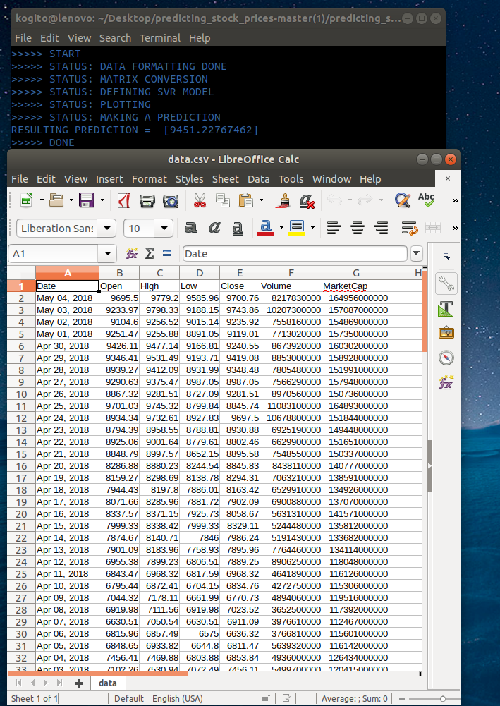
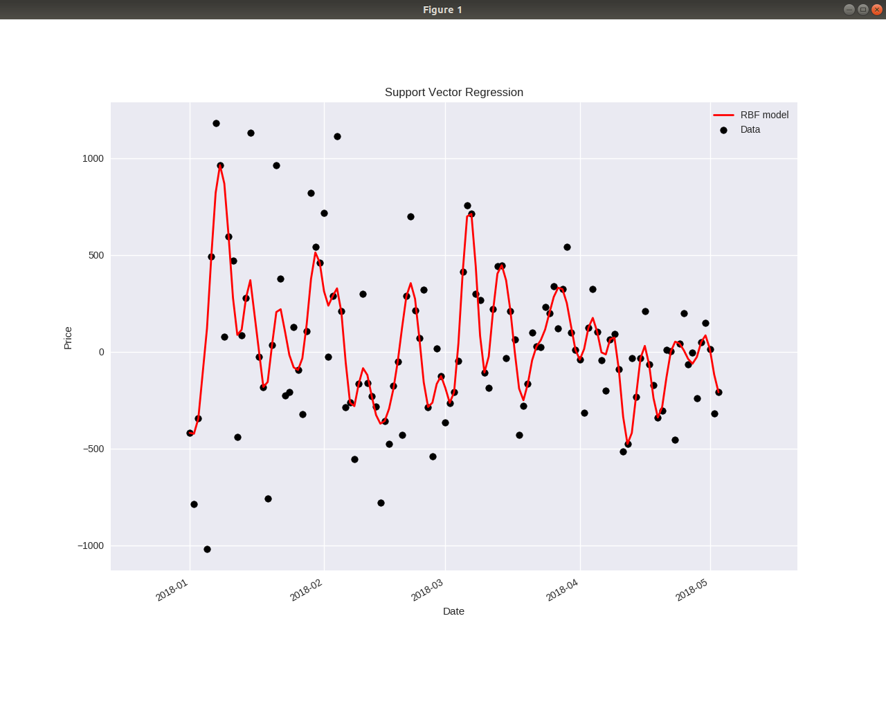

# Predicting_stock_prices
Stock/cryptocurrency price Prediction demo using support vectors regression and csv historical data extracted from CoinMarketCap.

## Overview
Based on the 'Learn Python for Data Science #3' code by youtuber @Sirajology on [YouTube](https://youtu.be/SSu00IRRraY). The code uses the [scikit-learn](https://github.com/scikit-learn/scikit-learn) machine learning library to train a [support vector regression](https://en.wikipedia.org/wiki/Support_vector_machine) on a stock price dataset from a csv file that can be generated using [CoinMarketCapScraper](https://github.com/SuperKogito/CoinMarketCapScraper) to predict a future price.

## Remark
I prefered to make the prediction based on the day to day price difference since that patch of data is less volatile and more stationary. I also threw out the max an min of the patch since they were outlayers that ruined the graph quality.

## Dependencies
* numpy (http://www.numpy.org/)
* pandas (https://pandas.pydata.org/)
* matplotlib (https://matplotlib.org/)
* csv (https://pypi.python.org/pypi/csv)
* scikit-learn (http://scikit-learn.org/stable/)


Install missing dependencies using [pip](https://pip.pypa.io/en/stable/installing/)

## Demo Usage
Once you have your dependencies installed via pip, run the demo script in terminal via

```
python demo.py
```
## Screenshots
This demo is tested under ubuntu 17 and 18. Moreover the shown screenshots are the results of a run based on the Bitcoin historical data (Jan 1,2018-May 5,2018).




## Credits
* Siraj (https://www.youtube.com/channel/UCWN3xxRkmTPmbKwht9FuE5A)
* stackoverflow
* Machine learning mastery (https://machinelearningmastery.com/)
